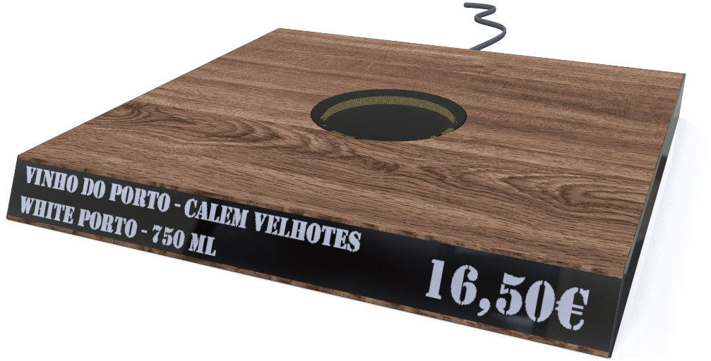

# e-Shelf

*More smart, less work*

## Grupo

       Pedro Assunção - a21003163
       Jorge Ferreira - a21603930

## Ìndice

[Documentos](docs)

[Design](design)

[Dispositivo Embebido](embedded)

[Servidor](server)

[Apresentação](presentation)
